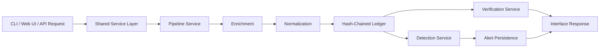

# KALYX


<p align="center">
  <b>Backend-driven execution integrity platform for tamper-evident capture, deterministic verification, and explainable behavioral detection.</b><br/>
  Hash-chained ledger · Shared service pipeline · FastAPI dashboard · Multi-interface operation
</p>

<p align="center">
  <a href="#overview"><b>Overview</b></a> ·
  <a href="#highlights"><b>Highlights</b></a> ·
  <a href="#architecture"><b>Architecture</b></a> ·
  <a href="#quick-start"><b>Quick Start</b></a> ·
  <a href="#interfaces"><b>Interfaces</b></a> ·
  <a href="#api-overview"><b>API Overview</b></a> ·
  <a href="#project-structure"><b>Project Structure</b></a>
</p>

## Overview

KALYX is a professional cybersecurity software system focused on one core problem: making execution history verifiable, not merely visible.

Instead of treating process events as ordinary logs, KALYX transforms them into hash-linked records, enriches them with execution context, normalizes them into a stable schema, and makes them available through a shared backend pipeline consumed by:

- a command-line interface for operator workflows
- a FastAPI layer for integration and automation
- a lightweight web dashboard for direct interaction

KALYX is intentionally deterministic, inspectable, and maintainable. It does not depend on probabilistic scoring or machine learning to decide whether ledger integrity holds.

## Why This Project Matters

Most monitoring tools answer:

> What did the system record?

KALYX is designed to answer:

> Can the recorded execution history still be trusted, and does it show suspicious behavior?

That distinction matters for:

- tamper-evident audit trails
- execution integrity validation
- forensic analysis
- academic evaluation of system architecture
- professional demonstrations of backend and security engineering

## Highlights

- hash-chained execution ledger with append-only semantics
- deterministic verification with corruption localization
- eBPF-oriented ingestion support
- contextual enrichment with user, tty, session, and parent process metadata
- normalization into canonical `action` and `target` fields
- rule-based behavioral detection with persisted alerts
- shared backend services consumed by CLI, API, and web UI
- lightweight dashboard served directly from FastAPI
- installable Python package via `pyproject.toml`

## Suggested Walkthrough

1. Start the API server.
2. Open the dashboard in a browser.
3. Retrieve ledger status.
4. Verify the ledger.
5. Ingest a test event from the dashboard or API.
6. Inspect alerts and verify the ledger remains valid.
7. Use the CLI to confirm the same shared backend state.

## Architecture

### Visual Architecture

```text
                         +----------------------+
                         |   External Sources   |
                         | sample logs / eBPF   |
                         +----------+-----------+
                                    |
                                    v
                    +---------------+----------------+
                    |        KALYX Services          |
                    |--------------------------------|
                    | Pipeline Service               |
                    | - parse                        |
                    | - enrich                       |
                    | - normalize                    |
                    | - hash-chain                   |
                    |                                |
                    | Ledger Service                 |
                    | - verify                       |
                    | - status                       |
                    | - export                       |
                    |                                |
                    | Detection Service              |
                    | - behavioral rules             |
                    | - alert persistence            |
                    +---------------+----------------+
                                    |
                +-------------------+-------------------+
                |                   |                   |
                v                   v                   v
          +-----+------+      +-----+------+      +-----+------+
          |    CLI     |      |    API     |      |  Web UI    |
          |   kalyx    |      |  FastAPI   |      | Dashboard  |
          +------------+      +------------+      +------------+
```

### Design Principles

- `single backend pipeline`: interface layers reuse shared services instead of re-implementing logic
- `deterministic behavior`: verification and rule detection are repeatable and explainable
- `thin adapters`: CLI, API, and web UI remain lightweight transport layers
- `maintainable separation`: ingestion, verification, detection, and presentation stay distinct

### Request Flow



## Interfaces

### CLI

The CLI remains a first-class operational interface.

```bash
kalyx ingest
kalyx ingest-live
kalyx verify
kalyx verify --format json
kalyx status
kalyx inspect
kalyx export
kalyx audit
kalyx detect
kalyx alerts
```

### API

The FastAPI layer exposes the existing backend functionality without duplicating business logic.

- `GET /` serves the dashboard
- `GET /status` returns current ledger status
- `POST /verify` performs deterministic verification
- `POST /ingest` appends a new event through the shared pipeline
- `GET /alerts` returns persisted alerts

### Web Dashboard

The dashboard is intentionally minimal and professional:

- centered single-page layout
- action buttons for common operations
- formatted JSON output
- lightweight styling
- no frontend framework dependency

## Quick Start

### Requirements

- Python `3.10+`
- `pip`
- Optional: `execsnoop-bpfcc` for live eBPF ingestion

### Installation

```bash
python3 -m venv .venv
source .venv/bin/activate
pip install -U pip
pip install -e .
```

### Start the API

```bash
kalyx-api
```

Or:

```bash
uvicorn kalyx.api.main:app --host 0.0.0.0 --port 8000
```

### Open the Dashboard

```text
http://127.0.0.1:8000/
```

### Quick CLI Check

```bash
kalyx status
kalyx verify --format json
```

## API Overview

### Core Endpoints

| Method | Route | Description |
| --- | --- | --- |
| `GET` | `/` | Serve the KALYX dashboard |
| `GET` | `/status` | Return current ledger status |
| `POST` | `/verify` | Verify ledger integrity deterministically |
| `POST` | `/ingest` | Ingest an event through the shared pipeline |
| `GET` | `/alerts` | Return persisted alert data |

### Example Requests

Get status:

```bash
curl http://127.0.0.1:8000/status
```

Verify the ledger:

```bash
curl -X POST http://127.0.0.1:8000/verify
```

Retrieve alerts:

```bash
curl http://127.0.0.1:8000/alerts
```

Ingest a structured test event:

```bash
curl -X POST http://127.0.0.1:8000/ingest \
  -H "Content-Type: application/json" \
  -d '{
    "event": {
      "comm": "touch",
      "pid": 5000,
      "ppid": 4000,
      "ret": 0,
      "argv": "touch sample.txt",
      "uid": 0
    },
    "source": "api"
  }'
```

## Detection Scope

KALYX currently supports deterministic rule-based detection for patterns such as:

- delete-then-create replacement behavior
- modify bursts across short time windows
- destructive bursts within a session
- scripted destructive actions in non-interactive contexts

Each detection produces structured persisted alerts rather than opaque model output.

## Project Structure

```text
kalyx/
├── api/
│   ├── app.py
│   ├── main.py
│   ├── dashboard.html
│   └── static/
│       └── style.css
├── cli/
│   ├── __init__.py
│   └── app.py
├── core/
│   ├── alerts.py
│   ├── chain.py
│   ├── detector.py
│   ├── normalize.py
│   └── verify.py
├── engine/
│   ├── enrichment.py
│   ├── ingest_execsnoop.py
│   ├── ingest_execsnoop_live.py
│   └── parser.py
├── models/
│   ├── __init__.py
│   └── api.py
├── services/
│   ├── detection.py
│   ├── ledger.py
│   └── pipeline.py
└── __init__.py
```

### Layer Responsibilities

| Layer | Responsibility |
| --- | --- |
| `core/` | Deterministic ledgering, normalization, verification, and alert persistence primitives |
| `engine/` | Ingestion-side parsing and enrichment helpers |
| `services/` | Shared orchestration used by every interface |
| `api/` | FastAPI transport layer and dashboard assets |
| `cli/` | Command-line adapter over the same backend services |
| `models/` | API request and response schemas |

## Technical Choices

### Shared Services Over Duplicated Logic

The API, CLI, and web dashboard all route through the same backend services. This keeps the system maintainable and ensures every interface reflects the same behavior.

### Deterministic Verification

Ledger validity is derived from canonical hashing and explicit chain linkage, not heuristic trust scores.

### Lightweight Frontend Integration

The dashboard is served by FastAPI and uses vanilla JavaScript `fetch()` calls. That keeps the interface easy to maintain while still making the platform usable in a browser.

### Explainable Detection

Behavioral detections are rule-based and structured so results are understandable during audits, demos, and academic review.

## Security Boundary

### KALYX Guarantees

- hash-linked, tamper-evident execution history
- deterministic verification of stored records
- precise corruption localization
- explainable, rule-based behavioral analysis
- consistent backend behavior across CLI, API, and web UI

### KALYX Does Not Guarantee

- protection against full host compromise
- authenticity of malicious but syntactically valid source events
- prevention of retrospective reconstruction without external anchoring
- complete coverage of advanced adversarial behavior

KALYX enforces integrity within the ledger boundary. Stronger non-repudiation depends on trusted ingestion and external anchoring.

## Local Development

Setup:

```bash
python3 -m venv .venv
source .venv/bin/activate
pip install -U pip
pip install -e .
```

Run:

```bash
kalyx-api
```

Open:

- Dashboard: `http://127.0.0.1:8000/`
- API docs: `http://127.0.0.1:8000/docs`

## Verification

Useful manual checks:

```bash
kalyx status
kalyx verify --format json
curl http://127.0.0.1:8000/status
curl -X POST http://127.0.0.1:8000/verify
curl http://127.0.0.1:8000/alerts
```

Manual smoke test:

1. Start `kalyx-api`.
2. Open the dashboard.
3. Click `Get Status`.
4. Click `Verify Ledger`.
5. Click `Ingest Test Event`.
6. Confirm the status output changes and verification remains valid.

## Use Cases

- execution integrity auditing
- tamper-evident event retention
- backend architecture demonstrations
- professional or academic software evaluation
- deterministic security workflow prototyping

## Roadmap Ideas

- external trust anchoring for ledger roots
- broader ingestion support
- richer dashboard views for ledger and alert exploration
- additional deterministic behavioral rules
- stronger automated test coverage

## Contributing

Contributions should preserve the architectural intent of the project:

- do not duplicate backend business logic across interfaces
- keep verification and detection deterministic
- prefer lightweight, modular implementation choices
- maintain CLI and API compatibility

## License

No license file is currently included in this repository.

## Vision

KALYX is not just a CLI tool and not just a dashboard.

It is a multi-interface execution integrity system built around one idea:

**execution history should be observable, verifiable, and professionally operable.**
