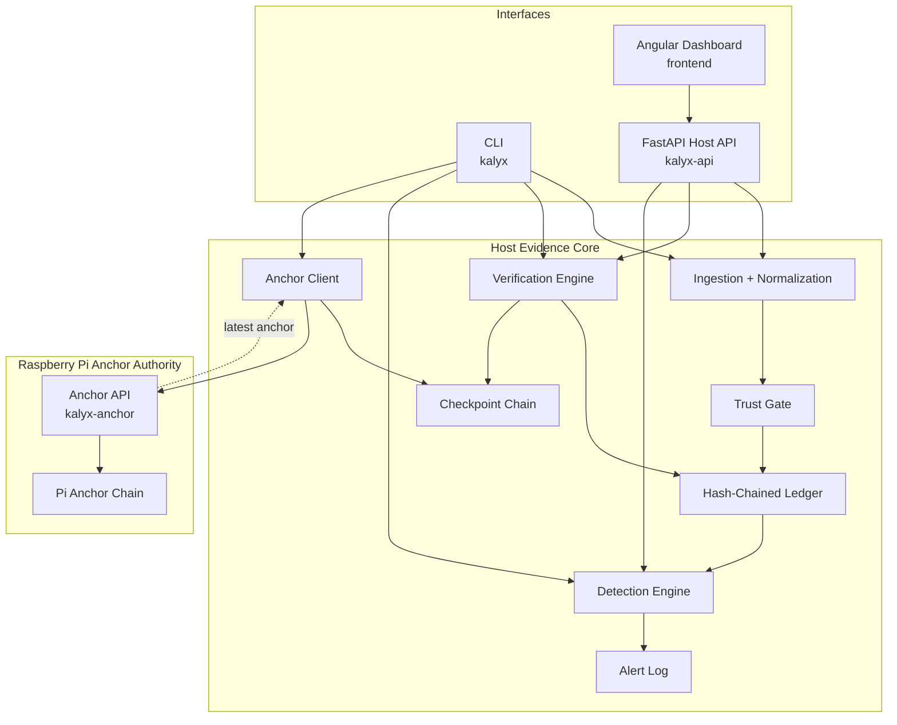
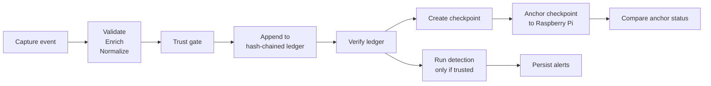

# KALYX


**Execution Evidence Integrity System**

KALYX is an execution evidence integrity system for capturing, verifying, and externally anchoring execution history.

KALYX is not an EDR, SIEM, antivirus, malware blocker, or full host attestation system. It does not prevent attacks. Its purpose is evidence integrity and trust verification.

---

## Problem

Local logs are useful, but they are not automatically trustworthy.

If an attacker can modify, reorder, truncate, or replace local history, a normal log file may still look plausible. A reviewer may see commands, timestamps, and process names, but not know whether earlier records were changed or deleted.

Evidence integrity matters because investigations depend on continuity:

- Was this record appended after the previous one?
- Did a record change after it was written?
- Was a verified boundary removed or replaced?
- Is the current ledger trusted enough for detection?
- Does an independent anchor still agree with the host?

KALYX addresses that problem by turning execution events into verifiable, hash-chained evidence.

---

## What KALYX Does

| Capability | Description |
|---|---|
| Execution ingestion | Accepts sample log events, raw execsnoop-style lines, structured API events, and live eBPF execsnoop output |
| Processing pipeline | Validates, enriches, normalizes, and chains events through shared backend services |
| Hash-chained ledger | Stores execution records in `logs/exec_chain.jsonl` with sequence number, previous hash, and canonical record hash |
| Verification engine | Recomputes the ledger chain and reports the first untrusted boundary |
| Local checkpoints | Stores verified ledger boundaries in `logs/checkpoints.jsonl` using chained checkpoint hashes |
| Trust-state enforcement | Blocks new ingestion when the ledger or checkpoint state is untrusted |
| Detection engine | Runs deterministic behavioral rules only after successful verification |
| Alert persistence | Stores deduplicated alerts in `logs/alerts.jsonl` |
| FastAPI host backend | Exposes status, ingestion, verification, detection, alerts, and ledger inspection |
| Angular dashboard | Provides a local operations console over the FastAPI backend |
| Raspberry Pi anchor authority | Stores checkpoint boundaries in an independent Pi-side hash chain |
| Anchor comparison | Compares the latest local checkpoint with the latest Raspberry Pi anchor |

---

## System Architecture

KALYX has three layers:

1. **Interfaces**: CLI, FastAPI host API, and Angular dashboard access the system.
2. **Host evidence core**: ingestion, validation, normalization, ledger chaining, verification, checkpoints, detection, alerts, and anchor submission.
3. **External anchor authority**: a Raspberry Pi service stores checkpoint boundaries in an independent anchor chain.

The interfaces are access layers. They do not implement separate integrity logic; they call the shared host evidence core.



| Layer | Component | Implementation | Responsibility |
|---|---|---|---|
| Interfaces | CLI | `kalyx/cli/app.py` | Operational commands for ingestion, verification, checkpoints, detection, alerts, and anchoring |
| Interfaces | FastAPI Host API | `kalyx/api/main.py` | HTTP access to shared host services |
| Interfaces | Angular Dashboard | `frontend/` | Local interface for trust state, ledger inspection, verification, ingestion, detection, alerts, and evidence JSON |
| Host Evidence Core | Pipeline | `kalyx/services/pipeline.py` | Validation, enrichment, normalization, and trust-gated append |
| Host Evidence Core | Ledger Service | `kalyx/services/ledger.py` | Ledger verification, checkpoints, trust states, status, and export |
| Host Evidence Core | Detection Service | `kalyx/services/detection.py` | Verification-gated detection and alert persistence |
| Host Evidence Core | Anchor Client | `kalyx/services/anchor_client.py` | Checkpoint submission and anchor-status comparison |
| External Anchor Authority | Raspberry Pi Anchor API | `kalyx/anchor/api.py` | Independent API for checkpoint anchoring and latest-anchor lookup |
| External Anchor Authority | Raspberry Pi Anchor Storage | `kalyx/anchor/storage.py` | Pi-side append-only anchor chain validation and persistence |

---

## End-To-End Workflow



- **Capture**: events enter through sample logs, raw execsnoop-style lines, structured API requests, or live eBPF ingestion.
- **Chain**: accepted events are validated, enriched, normalized, and appended to the hash-chained ledger after the trust gate passes.
- **Verify**: the verification engine recomputes ledger hashes and reports the first untrusted boundary.
- **Checkpoint**: trusted ledger boundaries are recorded in the local checkpoint chain.
- **Anchor**: checkpoint boundaries can be submitted to the Raspberry Pi authority and compared with the latest external anchor.
- **Detect**: deterministic rules run only on trusted evidence and persist deduplicated alerts.

---

## Trust Model

KALYX verifies evidence continuity. It does not prove event truth.

### What KALYX Can Verify

| Claim | How |
|---|---|
| A ledger record was changed after append | Recompute canonical record hash |
| A previous-hash link was broken | Compare each `prev_hash` with expected previous record hash |
| Ledger JSON is malformed | Decode and validate each ledger line |
| The first untrusted record boundary | Report `failure_index`, `valid_until_index`, and `last_valid_hash` |
| A local checkpoint was edited | Validate checkpoint self-hash |
| Checkpoint history was reordered or broken | Validate previous-checkpoint hash chain |
| Ledger fell behind a previous checkpoint | Compare current ledger against latest checkpoint boundary |
| Detection ran only on trusted evidence | Detection service verifies before replaying records |
| A checkpoint was externally anchored | Compare local checkpoint with latest Raspberry Pi anchor |

### What KALYX Cannot Verify

| Out Of Scope | Reason |
|---|---|
| Event source authenticity | KALYX validates event shape, not event truth |
| Kernel-level trust | Raw execsnoop lines are treated as input, not proof |
| Full host compromise resistance | A fully compromised host can alter local runtime and files |
| Malware prevention | KALYX records and verifies evidence; it does not block processes |
| Complete remote attestation | Raspberry Pi anchoring stores checkpoint boundaries, not full host state |
| Continuous anchor availability | Anchor comparison depends on the Pi service being reachable |

Core boundary:

```text
KALYX verifies records it accepted.
KALYX does not prove the original event source was truthful.
```

---

## Trust States

| Trust State | Meaning |
|---|---|
| `VERIFIED` | Ledger verifies successfully and does not conflict with the latest local checkpoint |
| `PARTIALLY_TRUSTED` | Verification failed, but earlier records before the failure remain trusted |
| `UNTRUSTED` | Ledger or checkpoint continuity cannot be trusted |
| `EMPTY` | Ledger file exists but contains no records |
| `NO_LEDGER` | No ledger file exists yet |

Ingestion is blocked when the current ledger or checkpoint state is untrusted. Detection is skipped when verification fails.

---

## External Anchor Workflow

KALYX includes an independent Raspberry Pi anchor authority.

The host creates local checkpoints. The Pi stores checkpoint boundaries in its own append-only hash chain. This gives the host a separate authority to compare against after local changes, truncation, or replacement.

### Start The Anchor Service

On the Raspberry Pi, or locally for testing:

```bash
kalyx-anchor
```

Default service port:

```text
http://127.0.0.1:8081
```

The Pi anchor stores records in:

```text
anchors/anchor_chain.jsonl
```

### Submit A Checkpoint

Create local evidence and a checkpoint:

```bash
kalyx ingest
kalyx verify --format json
kalyx checkpoint
```

Submit the latest checkpoint to the anchor service:

```bash
kalyx anchor --anchor-url http://127.0.0.1:8081 --ledger-id kalyx-main-host
```

`kalyx anchor` verifies the ledger, creates or reuses a safe local checkpoint, then sends the checkpoint boundary to the Pi service.

Anchor submission statuses include:

| Status | Meaning |
|---|---|
| `ACCEPTED` | New checkpoint boundary was stored |
| `ALREADY_ANCHORED` | Same ledger/checkpoint hash was already stored |
| `REJECTED_STALE` | Checkpoint index is older than the latest Pi anchor for that ledger |
| `REJECTED_INVALID` | Payload or existing Pi anchor chain failed validation |

### Compare Local And Pi State

```bash
kalyx anchor-status --anchor-url http://127.0.0.1:8081 --ledger-id kalyx-main-host
```

Comparison statuses:

| Status | Meaning |
|---|---|
| `MATCH` | Local checkpoint and Pi anchor have the same checkpoint index and hash |
| `BEHIND` | Pi anchor is newer than the local checkpoint |
| `AHEAD` | Local checkpoint is newer than the latest Pi anchor |
| `DIVERGENCE` | Checkpoint indices match, but checkpoint hashes differ |
| `NO_ANCHOR` | No Pi anchor exists for the selected ledger |
| `UNREACHABLE` | Pi anchor service could not be contacted |

Environment defaults:

```bash
export KALYX_ANCHOR_URL=http://127.0.0.1:8081
export KALYX_LEDGER_ID=kalyx-main-host
```

---

## Dashboard

The Angular dashboard is a local operations console over the FastAPI host API. It does not decide trust in the browser. It displays backend verification, ledger, checkpoint, detection, and alert state.

| Screen | Purpose |
|---|---|
| Overview | Current trust state, ledger state, checkpoint state, recent records, recent alerts |
| Ledger | Searchable/filterable ledger records with full JSON drawer |
| Verification | Run backend verification and inspect trust metadata |
| Ingestion | Submit structured events or raw execsnoop-style lines |
| Detection | Run verification-gated detection |
| Alerts | Search and filter persisted alerts |
| Evidence | Inspect raw backend JSON responses |

Run locally:

```bash
cd frontend
npm ci
npm start
```

Open:

```text
http://127.0.0.1:4200/
```

Default frontend API target:

```text
http://127.0.0.1:8000
```

Configured in:

```text
frontend/src/environments/environment.ts
```

---

## Quick Start

Install from a local checkout:

```bash
python3 -m venv .venv
source .venv/bin/activate
python3 -m pip install -U pip
python3 -m pip install -e . pytest
```

Run backend checks:

```bash
python3 -m compileall kalyx
python3 -m pytest -q
```

Create and verify a sample ledger:

```bash
kalyx ingest
kalyx verify --format json
kalyx status
```

Run detection:

```bash
kalyx detect
kalyx alerts
```

Start the host API:

```bash
kalyx-api
```

Start the dashboard:

```bash
cd frontend
npm ci
npm start
```

---

## CLI Reference

| Command | Purpose |
|---|---|
| `kalyx ingest` | Ingest sample events from `sample_exec.log` |
| `kalyx ingest-live` | Run live eBPF ingestion using `execsnoop-bpfcc` |
| `kalyx verify` | Verify ledger and write/reuse a checkpoint when safe |
| `kalyx verify --format json` | Print structured verification output |
| `kalyx status` | Show ledger, verification, trust, and checkpoint status |
| `kalyx checkpoint` | Create or reuse a local checkpoint |
| `kalyx checkpoint --format json` | Print checkpoint operation as JSON |
| `kalyx anchor` | Submit latest local checkpoint to the anchor service |
| `kalyx anchor-status` | Compare local checkpoint with latest Pi anchor |
| `kalyx inspect` | Print ledger entries in readable form |
| `kalyx export` | Export ledger records and verification state |
| `kalyx audit` | Display auditd ledger access events for `kalyx_ledger_watch` |
| `kalyx detect` | Run deterministic detection against trusted ledger evidence |
| `kalyx alerts` | Print persisted alerts |
| `kalyx --help` | Show command help |

---

## API Summary

KALYX has two FastAPI applications: the host API and the anchor API.

### Host API

Start:

```bash
kalyx-api
```

Base URL:

```text
http://127.0.0.1:8000
```

| Method | Route | Protection | Purpose |
|---|---|---|---|
| `GET` | `/` | Open | Minimal API-running page |
| `GET` | `/status` | Open | Ledger status, trust state, checkpoint metadata |
| `POST` | `/verify` | API key when configured | Verify ledger and write/reuse checkpoint when safe |
| `POST` | `/ingest` | API key when configured | Ingest raw line or structured event |
| `POST` | `/detect` | API key when configured | Run verification-gated detection |
| `GET` | `/alerts` | Open | Return persisted alerts |
| `GET` | `/ledger` | Open | Return recent parsed ledger records |

Optional local API-key protection:

```bash
export KALYX_API_KEY=example-dev-key
kalyx-api
```

Protected host routes then require:

```text
X-KALYX-API-Key: example-dev-key
```

This is lightweight local protection for operational routes. It is not user authentication, RBAC, OAuth, JWT, or source attestation.

### Anchor API

Start:

```bash
kalyx-anchor
```

Base URL:

```text
http://127.0.0.1:8081
```

| Method | Route | Purpose |
|---|---|---|
| `POST` | `/anchor` | Store a checkpoint boundary in the Pi anchor chain |
| `GET` | `/anchor/latest?ledger_id=...` | Return the latest anchor accepted for one ledger |

Detailed host API documentation lives in [docs/API_ENDPOINTS.md](docs/API_ENDPOINTS.md).

---

## Detection Rules

Detection is deterministic and rule-based. It runs only after successful ledger verification.

| Rule | Severity | Trigger |
|---|---|---|
| `DELETE_CREATE` | High | `DELETE` followed by `CREATE` on the same known target within 300 seconds |
| `MODIFY_BURST` | Medium | Repeated `MODIFY` actions against the same known target in a short window |
| `DESTRUCTIVE_BURST` | High | Multiple destructive actions by the same user/session within 15 seconds |
| `SCRIPTED_DESTRUCTIVE_ACTION` | High | `DELETE` or `MODIFY` launched by scripting parents outside interactive sessions |

Alerts are persisted with stable signatures to avoid duplicate writes across repeated or concurrent detection runs.

---

## Testing And Verification

KALYX tests focus on correctness properties that support its integrity claims.

Run:

```bash
python3 -m compileall kalyx
python3 -m pytest -q
```

Frontend build check:

```bash
cd frontend
npm ci
npm run build
```

| Area | Covered Behavior |
|---|---|
| Ledger integrity | Valid append, deterministic verification, hash mismatch detection |
| Corruption handling | Invalid JSON, invalid record type, previous-hash mismatch, payload hash mismatch |
| Concurrent appends | File-lock protected sequence and hash continuity under parallel writes |
| Pipeline validation | Missing fields, invalid PID/PPID, empty command rejection |
| Ingestion trust gate | Ingestion blocked after tampering or checkpoint inconsistency |
| Checkpoints | Creation, deduplication, self-hash validation, chain validation, truncation detection |
| Trust states | `VERIFIED`, `PARTIALLY_TRUSTED`, `UNTRUSTED`, `EMPTY`, `NO_LEDGER` behavior |
| Detection rules | Delete/create, modify burst, destructive burst, scripted destructive actions |
| Alert persistence | Deduplication and concurrent write safety |
| Host API | Status, ingest, verify, detect, alerts, ledger, API-key behavior |
| Anchor service | Anchor creation, anchor-chain integrity, stale rejection, latest lookup |
| Anchor CLI/client | `kalyx anchor`, `kalyx anchor-status`, environment overrides, comparison states |
| Angular service/state | API-key header behavior and trust-state display mapping |

GitHub Actions runs backend compile/tests and Angular production build on pushes and pull requests to `main`.

---

## Project Structure

```text
kalyx/
  anchor/
    api.py
    storage.py
  api/
    app.py
    dashboard.html
    main.py
    static/
      style.css
  cli/
    app.py
  core/
    alerts.py
    chain.py
    detector.py
    normalize.py
    verify.py
  engine/
    enrichment.py
    ingest_execsnoop.py
    ingest_execsnoop_live.py
    parser.py
  models/
    schema.py
  services/
    anchor_client.py
    detection.py
    ledger.py
    pipeline.py
  tests/
    test_alert_persistence.py
    test_anchor_service.py
    test_anchor_status.py
    test_api_auth.py
    test_api_endpoints.py
    test_checkpoint_integrity.py
    test_cli_anchor.py
    test_detection_rules.py
    test_ingestion_trust_gate.py
    test_ledger_corruption.py
    test_ledger_integrity.py
    test_pipeline_validation.py

docs/
  API_ENDPOINTS.md
  ARCHITECTURE.md
  CONFIGURATION.md
  DETECTION_ENGINE.md
  TESTING_SUMMARY.md
  THREAT_MODEL.md

frontend/
  angular.json
  package.json
  proxy.conf.json
  src/
    app/
      core/
      features/
      layout/
      shared/
    environments/

pyproject.toml
setup.py
requirements.txt
sample_exec.log
```

Runtime files are created locally and ignored by git:

```text
logs/exec_chain.jsonl
logs/checkpoints.jsonl
logs/alerts.jsonl
logs/.kalyx_status.json
anchors/anchor_chain.jsonl
reports/ledger_export.json
```

---

## Configuration

| Variable | Required | Purpose |
|---|---:|---|
| `KALYX_API_KEY` | No | Protects host API operational routes when configured |
| `KALYX_ANCHOR_URL` | No | Default anchor URL for `kalyx anchor` and `kalyx anchor-status` |
| `KALYX_LEDGER_ID` | No | Default ledger ID used for anchor submission and comparison |

Example:

```bash
export KALYX_API_KEY=example-dev-key
export KALYX_ANCHOR_URL=http://127.0.0.1:8081
export KALYX_LEDGER_ID=kalyx-main-host
```

Frontend API settings live in:

```text
frontend/src/environments/environment.ts
```

Default frontend API configuration points at:

```text
http://127.0.0.1:8000
```

Frontend configuration is visible in built JavaScript. Do not treat it as secret storage.

---

## Limitations

- KALYX does not prevent attacks or block processes.
- KALYX does not prove that an ingested event came from a truthful source.
- Raw execsnoop lines and structured API payloads are treated as input, not proof.
- A full host compromise can defeat local-only evidence.
- Raspberry Pi anchoring stores checkpoint boundaries, not full host state.
- Anchor comparison depends on the Pi service being reachable.
- Live eBPF ingestion requires a compatible Linux environment with `execsnoop-bpfcc` and suitable privileges.
- Ledger storage is local JSONL, not an indexed database.
- Verification is O(n) because each ledger record is recomputed in order.
- Detection uses deterministic rules, not ML or external threat intelligence.

---

## Design Tradeoffs

- **JSONL ledger**: simple, append-friendly, inspectable, and easy to verify line by line.
- **Canonical hashing**: deterministic serialization makes verification reproducible.
- **Local checkpoints**: record verified boundaries before external anchoring.
- **Raspberry Pi anchor**: provides an independent checkpoint authority without introducing a large distributed system.
- **Rule-based detection**: explainable, deterministic, and testable.
- **Thin interfaces**: CLI, API, and Angular call shared backend services instead of duplicating trust logic.
- **No database**: keeps the prototype inspectable and avoids operational complexity before indexed storage is needed.

---

## Further Documentation

| Document | Purpose |
|---|---|
| [docs/ARCHITECTURE.md](docs/ARCHITECTURE.md) | Backend architecture, service layers, request flow |
| [docs/API_ENDPOINTS.md](docs/API_ENDPOINTS.md) | Host API route details |
| [docs/DETECTION_ENGINE.md](docs/DETECTION_ENGINE.md) | Detection rules, semantics, limitations |
| [docs/THREAT_MODEL.md](docs/THREAT_MODEL.md) | Trust boundaries and out-of-scope assumptions |
| [docs/CONFIGURATION.md](docs/CONFIGURATION.md) | Environment and frontend API configuration |
| [docs/TESTING_SUMMARY.md](docs/TESTING_SUMMARY.md) | Test coverage and validation approach |

---

## Roadmap

Future work that is not implemented in the current repository:

- Signed checkpoint exchange between host and anchor
- Ledger segmentation and incremental verification
- Authenticated event-source ingestion
- Indexed alert and replay storage
- Stronger Raspberry Pi anchor hardening
- Browser-based Angular test coverage in CI
