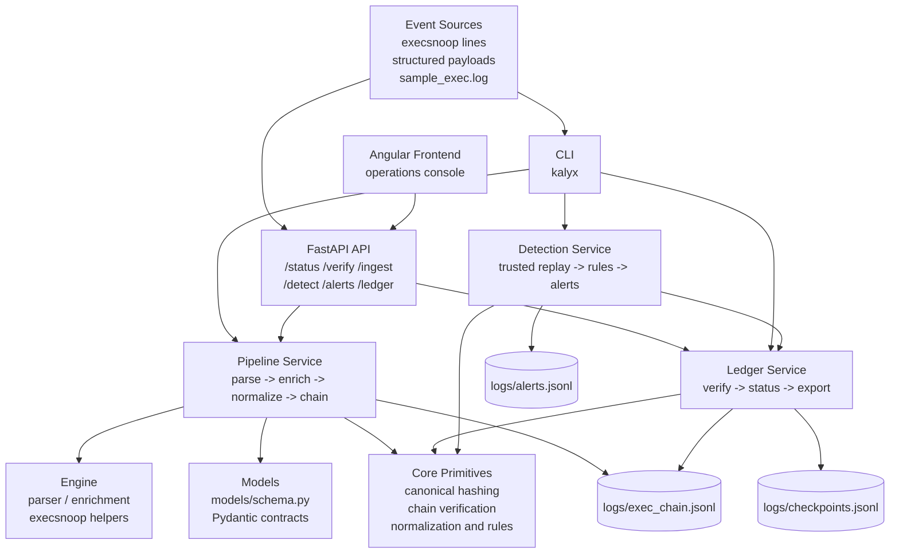
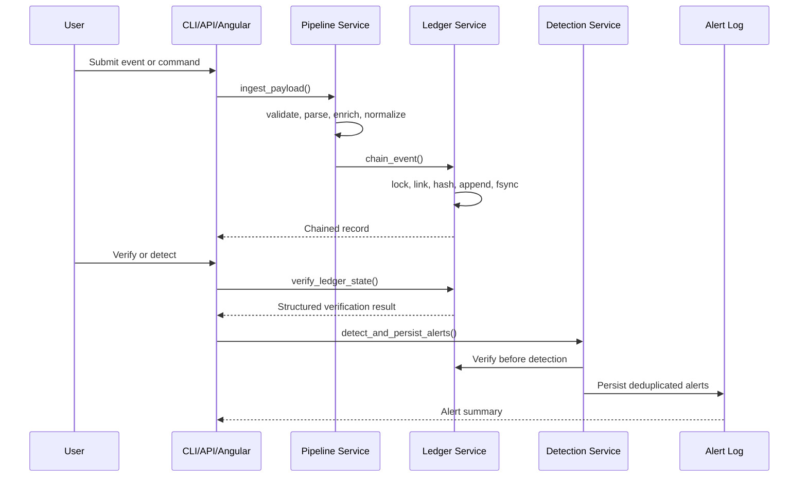

# KALYX


**Backend-controlled execution integrity workflow with deterministic verification and tamper-evident ledger semantics.**

KALYX is a backend-focused execution integrity project with a separate Angular operations console. It is not a commercial SIEM, EDR, malware prevention platform, or authoritative host attestation system. Its purpose is narrower and more inspectable: turn execution events into schema-validated, hash-chained records that can be verified, localized when corrupted, and consumed consistently by a CLI, FastAPI API, and Angular frontend.

- [Overview](#overview)
- [Core Capabilities](#core-capabilities)
- [Suggested Walkthrough](#suggested-walkthrough)
- [Architecture](#architecture)
- [Models](#models)
- [Interfaces](#interfaces)
- [Testing](#testing)
- [Security Boundary](#security-boundary)
- [Tradeoffs](#tradeoffs)
- [Roadmap](#roadmap)

## Overview

Execution integrity means the recorded history of execution events can be checked after the fact. A normal log may show what was written, but it usually cannot prove whether earlier lines were modified, reordered, truncated, or replaced without additional structure.

KALYX addresses that gap by converting execution events into canonical ledger records:

1. Input is accepted as either an execsnoop-style raw line or a structured event.
2. The event is schema-validated before it is trusted enough to enter the pipeline.
3. The event is enriched with local process context such as user, TTY, session, and parent process metadata.
4. The event is normalized into stable behavioural fields such as `action` and `target`.
5. The record is appended to a JSONL ledger with a sequence number, previous hash, timestamp, and canonical SHA-256 hash.
6. Verification recomputes the chain deterministically and reports the first untrusted boundary.
7. Verified ledger states can be written as local checkpoints that prepare the same evidence format for future external anchoring.

The result is not prevention and not proof that the original event source was authentic. It is verifiable backend evidence about the records KALYX accepted and chained.

## Core Capabilities

- **Append-only ledger**: execution records are written to `logs/exec_chain.jsonl` as newline-delimited JSON.
- **Canonical hashing**: hashes are computed from deterministic JSON serialization with sorted keys and compact separators.
- **Deterministic verification**: the verifier recomputes every record hash and chain link from genesis to the end of the ledger.
- **Corruption localization**: verification reports `failure_index`, `valid_until_index`, and the last trusted hash.
- **Schema validation**: ingestion rejects missing fields, invalid process IDs, negative parent process IDs, and empty command names.
- **Concurrent write safety**: ledger appends hold an exclusive file lock while reading the previous hash, assigning `seq`, hashing, writing, flushing, and syncing.
- **Local checkpoints**: successful verification can append a checkpoint to `logs/checkpoints.jsonl` with record count, last sequence, last hash, previous checkpoint hash, and checkpoint hash.
- **Trust-state reporting**: shared status logic maps verification and checkpoint continuity into states such as `VERIFIED`, `UNTRUSTED`, `PARTIALLY_TRUSTED`, `EMPTY`, and `NO_LEDGER`.
- **Replay-safe detection**: persisted alerts are deduplicated with stable signatures and file-lock protected alert writes.
- **CLI, API, and Angular console**: all interfaces call shared services instead of duplicating integrity logic.
- **Explainable alerts**: detection rules return deterministic alert objects with type, severity, target, sequence range, timestamps, and details.

## Why This Project Matters

Security tooling often starts with visibility: collect events, search them, and display them. KALYX focuses on the next question: whether the recorded history can still be trusted.

That distinction matters for:

- **Trust vs visibility**: seeing a log line is different from verifying that the chain of evidence has not changed.
- **Verifiable evidence**: canonical hashes and previous-hash links make record modification detectable.
- **Backend correctness**: integrity guarantees live in reusable services, not in the CLI or dashboard.
- **Operational auditability**: verification returns structured data that can be inspected, exported, and tested.

## Suggested Walkthrough

Install the project locally:

```bash
python3 -m venv .venv
source .venv/bin/activate
pip install -U pip
pip install -e .
```

Run the validation suite:

```bash
python3 -m compileall kalyx
pytest -q
```

Ingest sample execution events:

```bash
kalyx ingest
```

Verify the ledger:

```bash
kalyx verify --format json
```

Create or refresh the local checkpoint:

```bash
kalyx checkpoint
kalyx status
```

Tamper with a ledger record and observe deterministic failure:

```bash
cp logs/exec_chain.jsonl /tmp/kalyx-ledger.backup
python3 - <<'PY'
from pathlib import Path

path = Path("logs/exec_chain.jsonl")
lines = path.read_text(encoding="utf-8").splitlines()
lines[0] = lines[0].replace("touch", "rm", 1)
path.write_text("\n".join(lines) + "\n", encoding="utf-8")
PY
kalyx verify --format json
mv /tmp/kalyx-ledger.backup logs/exec_chain.jsonl
```

Run deterministic detection and inspect persisted alerts:

```bash
kalyx detect
kalyx alerts
```

Launch the FastAPI backend:

```bash
kalyx-api
```

Launch the Angular operations console in a separate terminal:

```bash
cd frontend
npm install
npm start
```

Then open the Angular frontend:

```text
http://127.0.0.1:4200/
```

From the browser console you can run the normal local demo flow: refresh status, verify the ledger, ingest structured or raw events, inspect recent ledger records, run deterministic detection, and review persisted alerts. The Angular frontend is only a presentation layer over the same FastAPI services used by the CLI. It does not decide whether evidence is trusted.

## Engineering Challenges

KALYX is intentionally small, but it exercises several backend problems that matter in integrity systems:

- **Concurrent append races**: multiple writers must not read the same previous hash and create conflicting chain links.
- **Malformed input rejection**: bad evidence should fail before it becomes hash-protected ledger state.
- **Corruption boundaries**: verification must identify the first untrusted record and preserve the last trusted hash.
- **Checkpoint continuity**: a locally valid ledger can still be suspicious if it falls behind the latest checkpoint.
- **Deterministic behaviour**: hashing, verification, sorting, and detection must produce repeatable results.
- **Replay-safe detection**: repeated detection runs and concurrent alert writes should not duplicate the same alert.
- **Thin interfaces**: CLI, API, and Angular console should expose shared backend behaviour without reimplementing it.
- **Honest trust boundaries**: local verification cannot claim source authenticity or survival after full host compromise.

## Architecture

KALYX is organized as layered backend services with thin interface adapters.



### Layered Responsibilities

- `kalyx/core`: deterministic primitives for chaining, verification rendering, normalization, alert signatures, and detection rules.
- `kalyx/engine`: input parsing and local process enrichment.
- `kalyx/services`: shared backend workflows used by every interface.
- `kalyx/models/schema.py`: Pydantic API request and response models.
- `kalyx/cli`: command-line adapter.
- `kalyx/api`: FastAPI adapter exposing backend endpoints and a minimal API status page.
- `frontend`: Angular operations console that calls FastAPI through the local dev proxy.

### Request Flow

For ingestion, interfaces call the same shared pipeline:

```text
request/event
  -> schema or pipeline validation
  -> parse raw line when needed
  -> enrich local context
  -> normalize action and target
  -> acquire ledger lock
  -> read previous valid hash
  -> assign sequence number
  -> compute canonical hash
  -> append JSONL record
```

For verification, the ledger service reads ledger lines in order and stops at the first invalid JSON record, invalid record type, previous-hash mismatch, or record-hash mismatch. That record and everything after it are treated as untrusted.

For checkpoint continuity, the ledger service compares the current ledger against the latest local checkpoint. If the current ledger has fewer records than the checkpoint or no longer contains the checkpointed hash at the checkpointed position, status reports a checkpoint gap and downgrades `trust_state` to `UNTRUSTED`.

## Models

### Execution Record Model

The ledger stores canonical JSONL records. A realistic record looks like:

```json
{
  "action": "CREATE",
  "argv": "touch /tmp/kalyx-demo.txt",
  "comm": "touch",
  "hash": "dfc8c2d1b1a2e3a7b6c4d8f91234567890abcdef1234567890abcdef12345678",
  "parent_comm": "bash",
  "parent_exe": "/usr/bin/bash",
  "pid": 41277,
  "ppid": 41010,
  "prev_hash": "0000000000000000000000000000000000000000000000000000000000000000",
  "ret": 0,
  "seq": 1,
  "session": "interactive_terminal",
  "source": "api",
  "target": "/tmp/kalyx-demo.txt",
  "ts": "2026-05-20T14:12:30.142381+00:00",
  "tty": "/dev/pts/2",
  "uid": 1000,
  "user": "parth"
}
```

### Verification Result Model

Verification returns structured evidence, not only a boolean:

```json
{
  "actual_hash": "7f5a1234...",
  "expected_hash": "bc931234...",
  "failure_index": 3,
  "last_valid_hash": "2aa8b73c...",
  "record_count": 5,
  "reason": "HASH_MISMATCH",
  "status": "TAMPERED",
  "trust_state": "PARTIALLY_TRUSTED",
  "valid": false,
  "valid_until_index": 2
}
```

Possible statuses include `VALID`, `TAMPERED`, `EMPTY`, and `NO_LEDGER`.

### Checkpoint Model

Local checkpoints are append-only JSONL records that summarize a verified ledger boundary:

```json
{
  "checkpoint_hash": "67f1c6e1...",
  "checkpoint_index": 2,
  "created_at": "2026-05-20T14:30:00.021000+00:00",
  "last_hash": "2aa8b73c...",
  "last_seq": 128,
  "ledger_file": "logs/exec_chain.jsonl",
  "previous_checkpoint_hash": "91a4c2d0...",
  "record_count": 128,
  "verification_status": "VALID",
  "verification_valid": true,
  "version": 1
}
```

This is still local evidence. It improves truncation/replacement detection against the latest checkpoint, and it gives the future Raspberry Pi anchor a stable payload format to receive.

### Alert Model

Rule-based detection emits explainable persisted alerts:

```json
{
  "delta_seconds": 2.0,
  "details": "DELETE followed by CREATE within 300s",
  "seq_end": 12,
  "seq_start": 11,
  "session": "interactive_terminal",
  "severity": "HIGH",
  "target": "/tmp/kalyx-demo.txt",
  "ts_end": "2026-05-20T14:19:04.020000+00:00",
  "ts_start": "2026-05-20T14:19:02.020000+00:00",
  "type": "DELETE_CREATE",
  "user": "parth"
}
```

## Request Flow Diagram



## Interfaces

### CLI

The CLI is the most complete operational interface:

```bash
kalyx ingest
kalyx ingest-live
kalyx verify
kalyx verify --format json
kalyx status
kalyx checkpoint
kalyx checkpoint --format json
kalyx inspect
kalyx export
kalyx audit
kalyx detect
kalyx alerts
kalyx --help
```

### API

The FastAPI layer exposes shared backend services without introducing separate business logic.

| Method | Route | Purpose |
| --- | --- | --- |
| `GET` | `/` | Serve a minimal API-running status page |
| `GET` | `/status` | Return ledger health and verification metadata |
| `POST` | `/verify` | Run deterministic ledger verification |
| `POST` | `/ingest` | Ingest one raw or structured execution event |
| `POST` | `/detect` | Run trusted-ledger-gated behavioural detection |
| `GET` | `/alerts` | Return persisted alerts |
| `GET` | `/ledger` | Return recent parsed ledger records for inspection |

Example structured ingestion:

```bash
curl -X POST http://127.0.0.1:8000/ingest \
  -H 'Content-Type: application/json' \
  -d '{
    "event": {
      "comm": "touch",
      "pid": 5000,
      "ppid": 4000,
      "argv": "touch /tmp/kalyx-api.txt",
      "ret": 0,
      "uid": 1000
    },
    "source": "api"
  }'
```

### Angular Operations Console

The Angular frontend in `frontend/` is the primary local demo interface. It is intentionally thin:

- Angular standalone components and router
- typed models and `HttpClient` API service
- reactive forms for ingestion
- no database
- no authentication yet
- no frontend-only integrity or detection logic

It calls only the backend API:

- `GET /status`
- `POST /verify`
- `POST /ingest`
- `POST /detect`
- `GET /alerts`
- `GET /ledger`

`GET /ledger` is for inspection only. Trust decisions still come from verification and status responses.

For local development, Angular runs separately and proxies API calls to FastAPI:

```bash
cd frontend
npm install
npm start
```

## Testing

Tests are part of the engineering story because KALYX is built around correctness claims. The suite checks behaviour that would be easy to break with casual refactoring:

- **Integrity verification tests** prove valid chained records verify successfully.
- **Tamper detection tests** prove payload edits produce `HASH_MISMATCH`.
- **Corruption tests** prove invalid JSON, mid-ledger corruption, hash corruption, and previous-hash corruption report the correct boundary.
- **Concurrent append tests** prove file-lock protected writes preserve sequence and chain consistency under parallel writers.
- **Malformed input tests** prove incomplete events, invalid PIDs, and blank commands are rejected before append.
- **Checkpoint tests** prove verified ledgers can create checkpoints, duplicate checkpoints are suppressed, truncation behind a checkpoint is reported, and trust state is downgraded.
- **Detection rule tests** prove deterministic alerts for delete/create replacement, modify bursts, destructive bursts, and scripted destructive actions.
- **Alert deduplication tests** prove duplicate and concurrent alert writes persist only one copy of the same stable alert signature.
- **API route tests** prove status, ingest, verify, detect, ledger, and alerts route handlers preserve shared backend behaviour.

Run:

```bash
python3 -m compileall kalyx
pytest -q
```

Frontend build:

```bash
cd frontend
npm install
npm run build
```

## Security Boundary

### What KALYX Guarantees

- Records accepted into the ledger are chained with deterministic canonical hashes.
- Local record edits, malformed ledger lines, broken previous-hash links, and hash mismatches are detectable.
- Verification identifies the first untrusted record and reports the last trusted index and hash.
- Local checkpoints detect truncation or replacement when the current ledger falls behind the latest checkpoint or no longer matches the checkpointed hash.
- Concurrent local writers are serialized for ledger appends.
- Alert persistence deduplicates stable alert signatures under concurrent writes.
- Detection is deterministic and explainable for the implemented rules.

### What KALYX Does Not Guarantee

- KALYX does not prove that an ingested event came from a truthful source.
- Ingestion authenticity is outside the current trust boundary.
- A full host compromise is outside the current guarantees.
- An attacker who can rewrite the complete ledger, local checkpoints, and all local state may evade local-only verification.
- External anchoring is not yet implemented.
- KALYX does not prevent attacks, block malware, or provide authoritative endpoint protection.

## Performance Limitations

- Ledger storage is JSONL on local disk.
- Verification is O(n) over the ledger because every record must be recomputed in order.
- Local checkpoint comparison is lightweight, but it does not replace full verification.
- There is no ledger segmentation or incremental checkpoint verification yet.
- Detection scans a recent replay window rather than using an index.
- Alert storage is append-only JSONL without query indexing.

These limits are intentional for the current scope: the project prioritizes deterministic behaviour and inspectable backend correctness over scale claims.

## Project Structure

```text
kalyx/
  api/
    app.py
    dashboard.html
    main.py
    static/
      style.css
  cli/
    app.py
  core/
    alerts.py
    chain.py
    detector.py
    normalize.py
    verify.py
  engine/
    enrichment.py
    ingest_execsnoop.py
    ingest_execsnoop_live.py
    parser.py
  models/
    schema.py
  services/
    detection.py
    ledger.py
    pipeline.py
  tests/
    test_alert_persistence.py
    test_api_endpoints.py
    test_checkpoint_integrity.py
    test_detection_rules.py
    test_ledger_corruption.py
    test_ledger_integrity.py
    test_pipeline_validation.py
docs/
  API_ENDPOINTS.md
  ARCHITECTURE.md
  DETECTION_ENGINE.md
  TESTING_SUMMARY.md
  THREAT_MODEL.md
logs/
  checkpoints.jsonl
  exec_chain.jsonl
frontend/
  angular.json
  package.json
  proxy.conf.json
  src/
    app/
      core/
      features/
      layout/
      shared/
pyproject.toml
setup.py
sample_exec.log
```

## Tradeoffs

- **Why JSONL**: it is append-friendly, reviewable, easy to corrupt deliberately in tests, and simple to verify line by line.
- **Why deterministic rules**: rule output can be explained, reproduced, tested, and deduplicated without hidden model state.
- **Why local checkpoints**: they provide a simple deletion/truncation warning before external anchoring exists, while using the same evidence shape the Raspberry Pi anchor can later store.
- **Why no database yet**: a database would add operational complexity before the project needs indexed storage.
- **Why no ML**: the current goal is correctness and explainability, not probabilistic classification.
- **Why explainability is prioritized**: integrity workflows need clear reasons, record boundaries, and evidence fields more than opaque scores.

## Roadmap

- Ledger segmentation
- Raspberry Pi external anchoring
- Signed checkpoint exchange
- Incremental verification
- Authenticated ingestion
- Typed alert schemas
- Indexed replay windows
