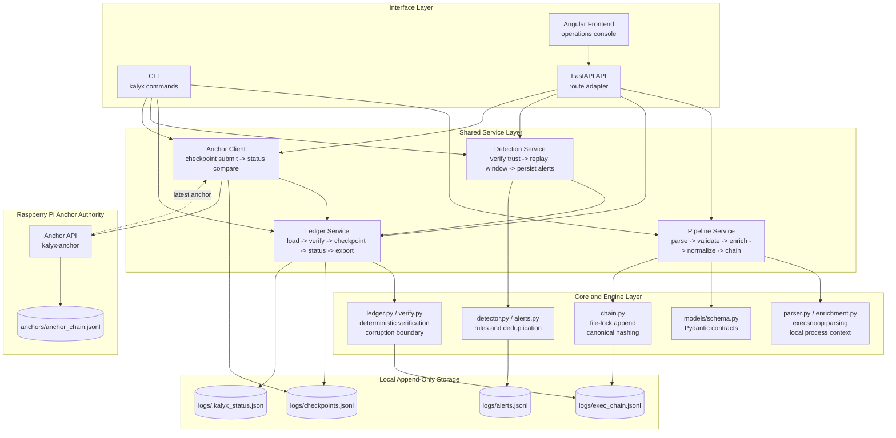
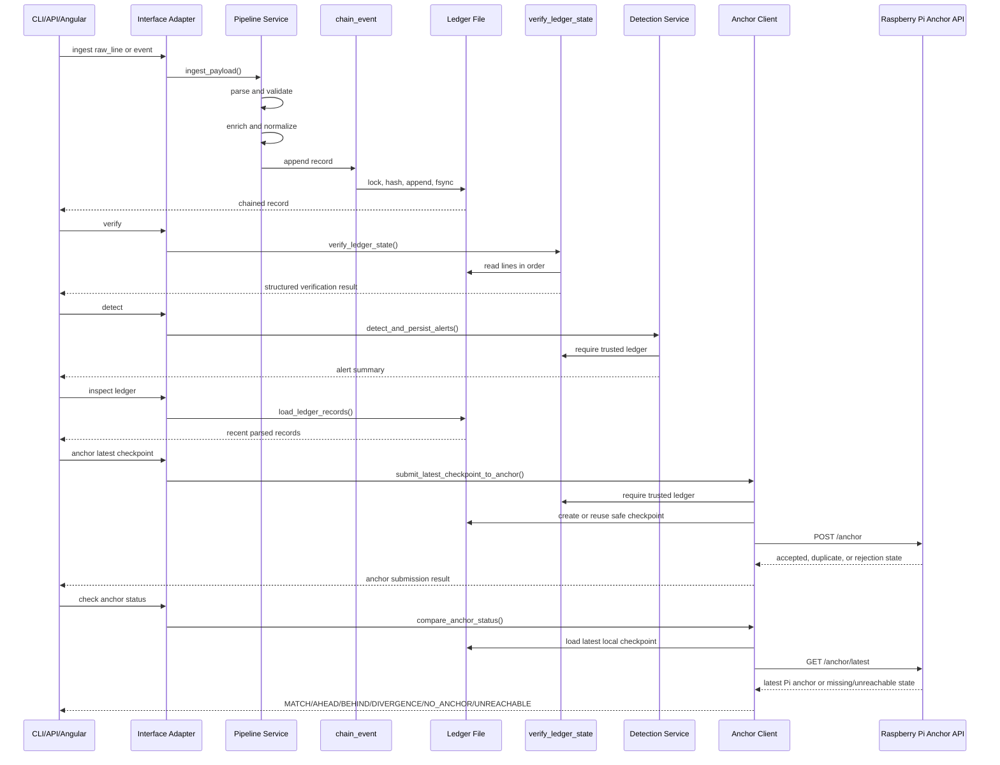
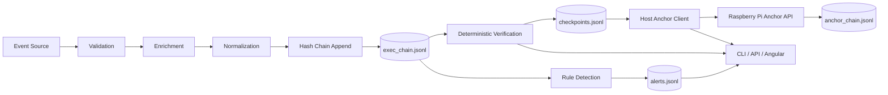

# KALYX Architecture

KALYX is organized as an integrity and anchoring workflow with thin interfaces. The core design goal is to keep verification, chaining, ingestion, detection, and anchor semantics in shared services so the CLI, FastAPI API, and Angular operations console all reflect the same backend behaviour.

## Layered Architecture



## Component Responsibilities

- `kalyx/api/main.py`: FastAPI route adapter and minimal API status page.
- `frontend/`: Angular operations console with routing, typed API service, forms, tables, filters, drawers, and evidence views.
- `kalyx/cli/app.py`: command dispatch and terminal rendering.
- `kalyx/models/schema.py`: API request and response contracts.
- `kalyx/services/pipeline.py`: shared parse, validate, enrich, normalize, and chain workflow.
- `kalyx/services/ledger.py`: ledger loading, deterministic verification, local checkpoints, trust-state classification, status, and export services.
- `kalyx/services/detection.py`: trusted-record replay, deterministic rule execution, and alert persistence.
- `kalyx/services/anchor_client.py`: host-side checkpoint submission and local-vs-Pi anchor status comparison.
- `kalyx/anchor/api.py`: Raspberry Pi FastAPI anchor authority for checkpoint submission and latest-anchor lookup.
- `kalyx/anchor/storage.py`: Pi-side append-only anchor chain validation and persistence.
- `kalyx/core/chain.py`: file-lock protected append-only hash chaining.
- `kalyx/core/detector.py`: deterministic behavioural rules and in-memory alert deduplication.
- `kalyx/core/alerts.py`: file-lock protected alert persistence and persisted alert deduplication.
- `kalyx/engine/parser.py`: execsnoop-style raw line parsing.
- `kalyx/engine/enrichment.py`: local user, TTY, session, and parent process enrichment.
- `kalyx/core/normalize.py`: command normalization into `action` and `target`.

## Shared Service Pipeline

Ingestion follows one backend path regardless of interface:

```text
raw_line or event
  -> parse raw line when supplied
  -> validate required fields
  -> enrich from local process context
  -> normalize command/action/target
  -> validate normalized event
  -> append to hash-chained ledger
```

The API, CLI, and Angular frontend do not implement their own ledger logic. They call or display results from `ingest_payload`, `verify_ledger_state`, `create_checkpoint`, `get_status_summary`, `detect_and_persist_alerts`, `load_ledger_records`, `load_alerts`, `submit_latest_checkpoint_to_anchor`, and `compare_anchor_status`.

The Angular console is the primary local demo interface, but it remains a presentation layer. It calls FastAPI endpoints for status, verification, ingestion, detection, alert retrieval, ledger inspection, anchor status, and anchor submission. It never decides whether evidence is trusted, and it never calls the Raspberry Pi anchor service directly.

## Trust Boundaries

```text
Untrusted input
  raw event lines
  structured API payloads
  local process metadata
        |
        v
Validation boundary
  required field checks
  integer coercion
  positive pid checks
  non-empty command checks
        |
        v
Local integrity boundary
  canonical record hashing
  previous-hash linking
  append serialization
  deterministic verification
```

KALYX can verify the continuity of records it has accepted. It does not prove that an external event source was truthful. Ingestion authenticity is outside the current boundary.

Local checkpoints add another local boundary: KALYX can compare the current ledger against the latest checkpoint and report if the ledger has been truncated or replaced behind that checkpoint. Because checkpoints are still local files, external anchoring is required before this becomes resilient to full local compromise.

External anchoring adds a separate authority boundary:

```text
Host verified checkpoint
        |
        v
Host Anchor Client
        |
        v
Raspberry Pi Anchor API
        |
        v
Pi append-only anchor chain
```

The host submits checkpoint boundaries and later compares the latest local checkpoint against the latest Pi anchor for the configured ledger ID. The Pi stores checkpoint boundaries; it does not verify full host state or replace local ledger verification.

## Concurrency Model

Ledger appends are serialized with an exclusive `fcntl` file lock in `chain_event`.

While holding the lock, KALYX:

1. Reads existing ledger lines.
2. Finds the last valid JSON object.
3. Reads the previous hash.
4. Assigns the next sequence number.
5. Computes the canonical record hash.
6. Appends the JSONL line.
7. Flushes and fsyncs the file.

This prevents concurrent writers from reading the same previous hash and producing duplicate or conflicting chain links.

Alert persistence uses the same file-lock pattern. While holding the alert lock, KALYX reloads existing alert signatures and only writes alerts whose stable signature is new.

## Local Checkpoint Model

Checkpoints are append-only records in `logs/checkpoints.jsonl`. A checkpoint is written only after successful verification and only when the current ledger does not conflict with the latest checkpoint.

Each checkpoint records:

- `record_count`
- `last_seq`
- `last_hash`
- `previous_checkpoint_hash`
- `checkpoint_hash`
- verification status and timestamp metadata

If a later ledger has fewer records than the checkpoint or the checkpointed record no longer has the checkpointed hash, KALYX reports a checkpoint gap and marks the operational `trust_state` as `UNTRUSTED`.

## Verification Semantics

Verification is deterministic and conservative.

For each ledger line, KALYX checks:

- the line is valid JSON
- the decoded value is an object
- `prev_hash` equals the expected previous hash
- `hash` equals the recomputed canonical hash

On the first failure, verification stops and returns:

- `status`
- `reason`
- `record_count`
- `failure_index`
- `valid_until_index`
- `last_valid_hash`
- mismatch-specific expected and actual values when available
- `trust_state`, derived from verification and checkpoint continuity

The failed record and every following record are treated as untrusted.

## Corruption Handling

KALYX distinguishes corruption classes:

- `INVALID_JSON`: a ledger line cannot be decoded.
- `INVALID_RECORD_TYPE`: a line decodes to something other than an object.
- `PREV_HASH_MISMATCH`: the chain link does not point to the expected previous hash.
- `HASH_MISMATCH`: the record payload no longer matches its stored hash.

This gives reviewers an exact corruption boundary rather than a vague pass/fail result.

## Detection Separation

Detection is intentionally separate from integrity verification.

`detect_and_persist_alerts` verifies the ledger first. If the ledger is not trusted, detection is skipped with `LEDGER_NOT_TRUSTED`. This prevents KALYX from generating behavioural alerts from corrupted evidence.

When verification succeeds, detection replays recent records, normalizes them, runs deterministic rules, deduplicates alerts, and persists new alerts to `logs/alerts.jsonl`.

`GET /ledger` exposes recent parsed ledger records for inspection in the Angular console. It is not a trust authority; trust decisions still come from deterministic verification and status metadata.

## Request Flow Diagram



## Data Flow Diagram


